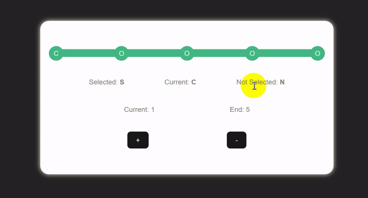

# Steps Process
<!-- description -->
Steps Process is a simple library to create a process with steps.

## Installation

```bash
npm install steps-process
```

## Usage

> ⚠ You may have to add a container for that packet because it depends on the parent width.

### VueJs

```html
<template>
<<<<<<< HEAD
  <div class='container'>
    <StepsProgress :current="2" cercleActiveColor="#42b883" progressHeight="8px" cercleHeight="30px"
          otherCercleColor="#656cff" cercleNotActiveColor="#646cff" cercleWidth="30px" backgroundHeight="10px" :end="5"
          backgroundColor="#42b883">
          <!-- use this for selected element -->
        <template #selected>
          <span>S</span>
        </template>
          <!-- use this for not selected element -->
        <template #not-selected>
          <span>O</span>
        </template>
          <!-- use this for current -->
        <template #current>
          <span>C</span>
        </template>
    </StepsProgress>
  </div>
=======
 <StepsProgress :current="2" cercleActiveColor="#42b883" progressHeight="8px" cercleHeight="30px"
      otherCercleColor="#656cff" cercleNotActiveColor="#646cff" cercleWidth="30px" backgroundHeight="10px" :end="5"
      backgroundColor="#42b883">
        <!-- use this for selected element -->
      <template #selected>
        <span>S</span>
      </template>
        <!-- use this for not selected element -->
      <template #not-selected>
        <span>N</span>
      </template>
        <!-- use this for current -->
      <template #current>
        <span>C</span>
      </template>
</StepsProgress>
>>>>>>> f6c719a50a455a9a0761dded5b7df57ff15cca6d
</template>
```

```css
.container {
  width: 500px;
}
```

```js
import StepsProgress from 'steps-process'
export default{
    components: {
        StepsProgress
    },
    ...
}
```

## Example

<!-- gif-->

